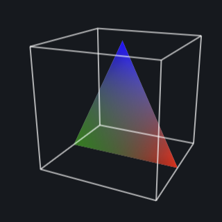
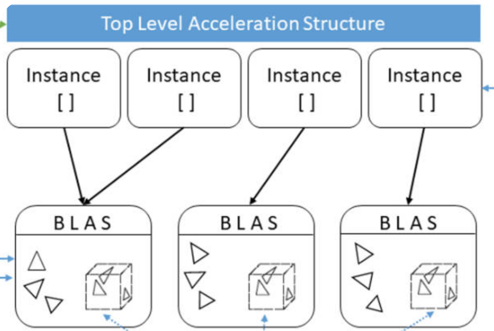

Acceleration Data Structures
============================

Ray tracing against a mesh becomes expensive if every ray is tested against every
primitive. A model with many triangles, tetrahedra, or other mesh elements needs
an acceleration structure so most primitives can be rejected before the more
expensive ray-primitive intersection tests are performed.

XDG relies primarily on :term:`BVH`-based acceleration structures. In keeping
with the XDG design philosophy (:ref:`design_philosophy`), these structures are
built and traversed by the selected ray tracing backend, which is separable from
the supported mesh backends. On CPUs, XDG currently relies on the :term:`Embree`
ray tracing kernels for BVH construction and traversal.

Axis-Aligned Bounding Boxes
---------------------------

The basic building block of these data structures is an axis-aligned bounding
box (AABB). An AABB is a conservative box around a primitive or group of
primitives, aligned with the coordinate axes. Ray-box intersection is much
cheaper than ray-primitive intersection, so a ray that misses an AABB can skip
everything inside it.

   Axis-aligned bounding boxes provide simple bounding volumes for ray
   intersection tests.

Bottom-Level Acceleration Structures
------------------------------------

A :term:`BLAS` is a lower-level acceleration structure built over the
primitives of one piece of geometry. In practice, this is commonly a BVH:
leaf nodes reference primitives, while internal nodes store AABBs that enclose
their child nodes. Traversal starts at the root of the tree and only descends
into child boxes that the ray intersects. The diagram below shows a simple BLAS
with AABBs at each node and triangles at the leaves:

.. figure:: ../assets/BLAS.png
   :alt: Bottom-level acceleration structure diagram
   :align: center
   :width: 100%

   A BLAS partitions geometry into a hierarchy of bounding volumes.

Top-Level Acceleration Structures
---------------------------------

Many ray tracing libraries use a two-level acceleration structure made from a
:term:`TLAS` and one or more :term:`BLAS`\s. The TLAS itself contains only
references to these BLASs, which means individual BLASs can be used across
multiple TLASs. Since they reference the whole data
structure rather than individual mesh primitives, a ray can first traverse the
TLAS and reject whole sections of geometry if it misses the associated BLAS. It
then only traverses into the relevant BLASs that the ray intersects,
making tree traversal more efficient after large regions have already been
culled by TLAS traversal. The diagram below shows a simple TLAS with two BLASs:

   Khronos illustration of a TLAS over lower-level BLASs.

Mixed Precision Ray Tracing
===========================

The paper "Hardware-Accelerated Ray Tracing of CAD-Based Geometry for Monte
Carlo Radiation Transport" discusses the use of mixed-precision algorithms
to efficiently handle complex CAD-based geometries in Monte Carlo radiation
transport simulations. The key contributions of the paper include leveraging
modern ray tracing kernels to significantly speed up the ray tracing process,
which is critical for handling the high computational demands of Monte Carlo
methods [1]_.

By integrating the techniques discussed in the paper, XDG achieves
faster BVH construction and traversal, leading to more efficient simulations.
This is particularly beneficial for applications involving complex geometries
and large-scale simulations, where traditional CPU-based methods may fall short
in terms of performance.

.. [1] P. Shriwise, P. Wilson, A. Davis, P. Romano, "Hardware-Accelerated Ray
       Tracing of CAD-Based Geometry for Monte Carlo Radiation Transport," in
       *IEEE Computing in Science and Engineering*, vol. 24, no. 2, pp. 52-61,
       February 2022, doi: 10.1109/MCSE.2022.3154656.

GPU-Accelerated Ray Tracing
===========================

Ray tracing as a technique is highly parallelizable and has been extensively
optimized for GPU architectures in the context of graphics rendering. As a
result, there is a rich ecosystem of GPU-accelerated software and even
specialized hardware (see :term:`RT hardware acceleration`) for ray tracing
operations. Historically, these capabilities have focused on single-precision
support and have not typically been adopted in the scientific computing
community.

XDG is intended to support GPU acceleration and provide an interface for
leveraging GPU-accelerated ray tracing in scientific computing applications.
An explicit focus is being placed on vendor-agnostic GPU support to ensure that
XDG can be used across a wide range of hardware platforms. Currently, initial
scoping of the GPU API is underway with work being done to support :term:`GPRT`
(General Purpose Ray Tracing Toolkit), a Vulkan-based GPU-only ray tracing
library that is vendor-agnostic and built around the Vulkan API. Other GPU ray
tracing libraries will also be explored in the future, with the eventual goal of
providing complete feature parity between CPU and GPU backends of XDG.

Backend Terminology Mapping
---------------------------

The BLAS/TLAS terminology is useful for describing the common two-level
acceleration structure pattern, but XDG does not require every backend to expose
explicit BLAS and TLAS objects. In XDG's Embree backend, ``RTCGeometry`` maps
functionally to a BLAS and ``RTCScene`` maps functionally to a TLAS. Embree
still builds the concrete acceleration structures internally when those objects
are committed, and the current XDG Embree backend attaches geometries directly
to scenes rather than using Embree instance geometries. Conceptually, the
BLAS/TLAS terminology still applies, while a GPU library like GPRT represents
the BLAS/TLAS and instancing model more explicitly.

For :term:`surface tracking`, XDG traces against the boundary surfaces of a
topological volume where each surface has its own BLAS:

.. list-table:: Surface tracking acceleration structure mapping
   :header-rows: 1
   :widths: 24 38 38

   * - Concept
     - Embree
     - GPRT
   * - **TLAS**
     - ``RTCScene`` containing ``RTCGeometry`` BLAS for each of the volume's
       boundary surfaces
     - ``GPRTAccel`` containing ``gprt::Instance`` objects for the
       ``GPRTAccel`` BLASs of the volume's boundary surfaces
   * - **BLAS**
     - ``RTCGeometry`` with user-defined AABBs over surface primitives
     - ``GPRTAccel`` created from a ``GPRTGeom`` with user-defined AABBs
       over surface primitives
   * - **Instancing**
     - Not used currently; ``RTCGeometry`` objects are attached directly to
       ``RTCScene`` objects
     - ``gprt::Instance`` objects created from BLASs and used with the TLAS
   * - **Topological volume**
     - Per-volume ``RTCScene`` containing the boundary-surface geometries
     - TLAS over the BLASs for the volume's boundary surfaces
   * - **Topological surface**
     - Cached ``RTCGeometry`` over the surface's triangle faces
     - ``GPRTGeomOf<DPTriangleGeomData>`` and ``GPRTAccel`` BLAS over the
       surface's triangle faces

For :term:`volume tracking`, XDG traces against the volumetric elements inside a
topological volume where each volume has exactly one BLAS containing all of its
elements. In the current Embree backend this is a one-geometry-per-scene
mapping. Volumetric tracking has not been implemented with GPRT yet, so the
table below reflects the intended TLAS/BLAS mapping:

.. list-table:: Volume tracking acceleration structure mapping
   :header-rows: 1
   :widths: 24 38 38

   * - Concept
     - Embree
     - GPRT
   * - **TLAS**
     - ``RTCScene`` containing a single ``RTCGeometry`` for the volume's
       elements
     - ``GPRTAccel`` containing a ``gprt::Instance`` object for the
       volume-element ``GPRTAccel`` BLAS
   * - **BLAS**
     - ``RTCGeometry`` with user-defined AABBs over volumetric elements
     - ``GPRTAccel`` created from a ``GPRTGeom`` with user-defined AABBs
       over volumetric elements
   * - **Instancing**
     - Not used currently; the volume ``RTCGeometry`` is attached directly to
       the volume ``RTCScene``
     - ``gprt::Instance`` object created from the volume-element BLAS and used
       with the TLAS
   * - **Topological volume**
     - Per-volume ``RTCScene`` containing a single ``RTCGeometry`` for the
       volume's elements
     - TLAS over the volume-element BLAS instance
   * - **Topological surface**
     - Part of the topology, but not represented in this volume-element
       BLAS/TLAS mapping
     - Part of the topology, but not represented in the volume-element
       BLAS/TLAS mapping
